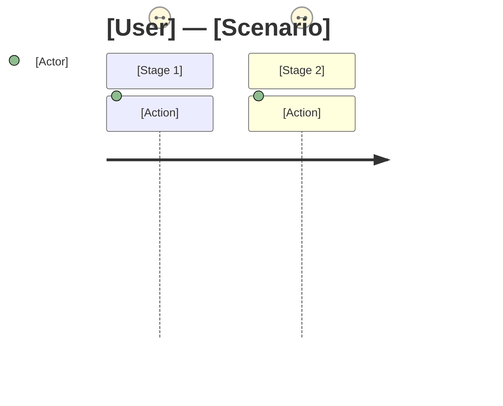

# Journey Mapping

## When to Use

- Visualizing how a user moves through a process from start to finish
- Identifying pain points, drop-off risks, and moments of delight
- Comparing the current-state experience with a desired future-state
- Providing the system-designer with experience-level context before technical design
- Aligning stakeholders on what the user actually goes through

## Procedure

### 1. Define the Scope

Determine the journey boundaries:

- **Who** is the user? (Reference a persona from `docs/design/personas/` if one exists, otherwise note the role)
- **What** is the scenario or goal they are trying to accomplish?
- **Where** does the journey start and end?

Search `docs/design/` for existing personas or empathy maps to ground the journey.

### 2. Identify Stages

Break the experience into sequential stages. Each stage represents a distinct phase of the user's interaction.

| Stage  | User Goal                        | Actions        | Touchpoints                                  |
| ------ | -------------------------------- | -------------- | -------------------------------------------- |
| _name_ | _what they're trying to achieve_ | _what they do_ | _channels, tools, people they interact with_ |

### 3. Map the Emotional Arc

For each stage, capture the user's emotional state:

| Stage  | Thinking                         | Feeling                                                      | Pain Points                   | Opportunities                    |
| ------ | -------------------------------- | ------------------------------------------------------------ | ----------------------------- | -------------------------------- |
| _name_ | _internal questions or thoughts_ | _emotional state (frustrated, confident, anxious, relieved)_ | _friction, confusion, delays_ | _ways to improve the experience_ |

### 4. Visualize as a Mermaid Journey Diagram

Produce a Mermaid `journey` diagram summarizing the experience:

Satisfaction scores: 1 = very frustrated, 3 = neutral, 5 = delighted.

### 5. Identify Key Insights

Summarize:

- **Biggest pain point** — the stage with the lowest satisfaction and highest impact
- **Moment of truth** — the make-or-break interaction that shapes the user's overall perception
- **Quick wins** — low-effort changes that would noticeably improve the experience
- **Systemic issues** — deeper problems that require design or architecture changes

### 6. Save the Journey Map

Write the journey map to `docs/design/journey-maps/<persona>-<scenario>.md`.

## Output Format

The journey map document should contain:

1. Journey metadata (user, scenario, date)
2. Stage table with goals, actions, and touchpoints
3. Emotional arc table
4. Mermaid journey diagram
5. Key insights and recommended next steps

## Rules

- ALWAYS ground the journey in empathy data — do not fabricate user emotions without evidence
- One journey map per persona-scenario combination
- Current-state maps describe what IS, not what should be — label future-state maps explicitly
- Flag assumptions that need validation and hand them to Assumption Testing
