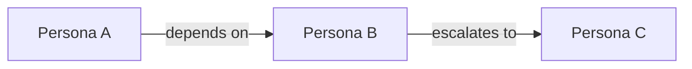

# Persona Definitions

## When to Use

- Starting a new design effort and need to establish who the users are
- Teams are making assumptions about users without a shared reference
- Grounding journey maps, empathy maps, or ideation sessions in specific user archetypes
- Communicating user needs to technical teams who may not interact with users directly
- Prioritizing which user segments to design for first

## Procedure

### 1. Gather Inputs

Before creating a persona, collect evidence:

- Check `docs/design/personas/` for existing personas — update rather than duplicate
- Check `docs/design/empathy-maps/` for empathy research
- Search for any stakeholder analysis or user research in `docs/design/`
- Ask the user what they know about this stakeholder group

### 2. Define the Persona

For each persona, capture:

| Field                   | Description                                                            |
| ----------------------- | ---------------------------------------------------------------------- |
| **Name**                | A realistic first name that makes the persona memorable and human      |
| **Role**                | Their job title, function, or relationship to the system               |
| **Background**          | Brief context — experience level, team size, industry, typical workday |
| **Goals**               | What they are trying to accomplish (2–4 primary goals)                 |
| **Behaviors**           | How they typically interact with systems, processes, or teams          |
| **Frustrations**        | What blocks them, slows them down, or causes stress                    |
| **Needs**               | What they require from the system to succeed                           |
| **Tools & Environment** | What tools, devices, and channels they use today                       |
| **Quote**               | A representative statement that captures their mindset (1 sentence)    |

### 3. Map Relationships

If multiple personas exist, show how they relate:

- Who depends on whom?
- Where do their goals align or conflict?
- Who has the most influence on the system's success?

Use a simple relationship table or Mermaid diagram:

### 4. Prioritize

Not all personas are equal. Classify each as:

- **Primary** — the system is designed around their needs
- **Secondary** — the system must accommodate them but is not optimized for them
- **Tertiary / Negative** — stakeholders the system explicitly does NOT target

### 5. Save the Persona

Write each persona to `docs/design/personas/<name>.md`.

## Output Format

Each persona document should contain:

1. Persona card (the table from step 2)
2. Scenario summary — a day-in-the-life paragraph showing how they encounter the system
3. Relationship notes (if other personas exist)
4. Priority classification
5. Open questions — what we still don't know about this user

## Rules

- Personas must be grounded in evidence (empathy maps, interviews, observation) — label any assumptions explicitly
- Use realistic but fictional names — never use real people's names
- Keep personas concise — a persona that nobody reads is useless
- Revisit and update personas as new empathy data emerges
- One file per persona in `docs/design/personas/`
