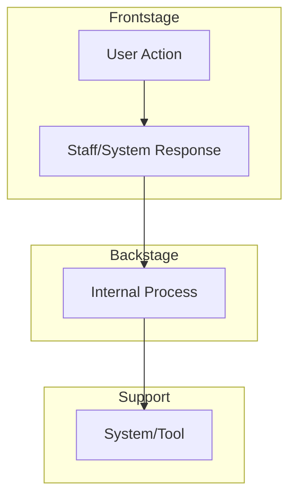

# Service Blueprinting

## When to Use

- A journey map exists and you need to add the operational layer behind the user experience
- Designing a service that involves multiple teams, channels, or systems working together
- Identifying where backstage failures cause frontstage pain
- Finding handoff gaps between teams or systems
- Preparing inputs for the system-designer to model service interactions

## Procedure

### 1. Define the Scope

Determine boundaries:

- **Which service or process** is being blueprinted?
- **Which user journey** does it support? (Reference `docs/design/journey-maps/` if available)
- **Start and end points** of the blueprint

### 2. Identify the Layers

A service blueprint has five layers, separated by three key lines:

```
┌─────────────────────────────────┐
│  Physical Evidence              │  ← What the user sees/touches
├─── Line of Interaction ─────────┤
│  Frontstage Actions             │  ← User-facing actions by staff/system
├─── Line of Visibility ──────────┤
│  Backstage Actions              │  ← Behind-the-scenes actions users don't see
├─── Line of Internal Interaction ┤
│  Support Processes              │  ← Systems, tools, and infrastructure
└─────────────────────────────────┘
│  Time / Stages →                │
```

### 3. Map Each Stage

For each stage of the service, fill in all five layers:

| Stage   | Physical Evidence                | Frontstage Actions             | Backstage Actions                       | Support Processes                 |
| ------- | -------------------------------- | ------------------------------ | --------------------------------------- | --------------------------------- |
| _stage_ | _what the user sees or receives_ | _visible staff/system actions_ | _hidden actions that enable frontstage_ | _systems, APIs, databases, tools_ |

### 4. Identify Fail Points and Wait Points

Mark critical points on the blueprint:

- **Fail points** (⚠) — where the process is likely to break down
- **Wait points** (⏳) — where the user experiences delay
- **Decision points** (◆) — where the process branches based on conditions

### 5. Visualize as a Mermaid Diagram

Produce a Mermaid flowchart or sequence diagram showing the service layers:



### 6. Analyze Gaps

Identify:

- **Visibility gaps** — backstage problems invisible to frontstage actors
- **Handoff gaps** — where responsibility transfers between teams or systems
- **Capacity gaps** — where backstage resources are insufficient for frontstage demand
- **Information gaps** — where actors lack data they need to act

### 7. Save the Blueprint

Write to `docs/design/service-blueprints/<service>.md`.

## Output Format

Each service blueprint document should contain:

1. Blueprint metadata (service, journey reference, date)
2. Layer mapping table
3. Fail/wait/decision point annotations
4. Mermaid diagram
5. Gap analysis with recommended actions

## Rules

- ALWAYS pair with a journey map — the blueprint shows the backstage of a frontstage experience
- Include all five layers — skipping layers hides important gaps
- Mark fail points explicitly — these are the highest-value findings
- Hand system structure questions to the `system-designer`
- One blueprint per service scope
