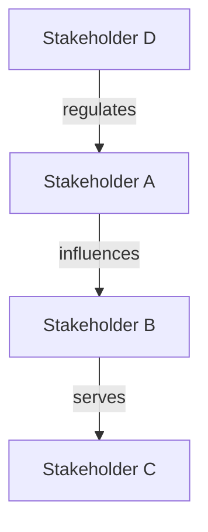

# Stakeholder Mapping

## When to Use

- Starting a new project or entering an unfamiliar domain
- Determining which user groups to build personas or empathy maps for
- Understanding who influences, is affected by, or operates the system
- Resolving competing priorities between different user groups
- Ensuring no important stakeholder group is overlooked

## Procedure

### 1. Identify Stakeholders

Cast a wide net. Consider everyone who:

- **Uses** the system directly (end users, operators)
- **Is affected by** the system's outputs (downstream consumers, customers)
- **Operates or maintains** the system (support staff, administrators)
- **Funds or governs** the system (sponsors, regulators, compliance)
- **Builds** the system (developers, designers, product managers)

List all identified stakeholders:

| #   | Stakeholder Group | Relationship to System                         | How They're Affected |
| --- | ----------------- | ---------------------------------------------- | -------------------- |
| 1   | _group name_      | _user / operator / sponsor / regulator / etc._ | _brief description_  |

### 2. Map Power and Interest

Place each stakeholder on a power/interest grid:

|                | Low Interest   | High Interest  |
| -------------- | -------------- | -------------- |
| **High Power** | Keep Satisfied | Manage Closely |
| **Low Power**  | Monitor        | Keep Informed  |

| Stakeholder | Power (1–5) | Interest (1–5) | Quadrant                                                    |
| ----------- | ----------- | -------------- | ----------------------------------------------------------- |
| _group_     | _score_     | _score_        | _Manage Closely / Keep Satisfied / Keep Informed / Monitor_ |

### 3. Assess Alignment and Conflict

Identify where stakeholder goals align or conflict:

| Stakeholder A | Stakeholder B | Alignment / Conflict              | Description                |
| ------------- | ------------- | --------------------------------- | -------------------------- |
| _group_       | _group_       | _Aligned / Conflicting / Neutral_ | _how their goals interact_ |

Conflicts are design opportunities — they reveal trade-offs the system must address.

### 4. Prioritize for Research

Based on the power/interest map, recommend a research priority:

| Priority | Stakeholder Group | Rationale   | Recommended Next Step                 |
| -------- | ----------------- | ----------- | ------------------------------------- |
| 1        | _group_           | _why first_ | Empathy Mapping / Persona Definitions |
| 2        | _group_           | _why next_  | _activity_                            |

### 5. Visualize Relationships

Produce a Mermaid diagram showing stakeholder relationships:

### 6. Save the Stakeholder Map

Write to `docs/design/stakeholder-maps/<project-or-domain>.md`.

## Output Format

Each stakeholder map document should contain:

1. Stakeholder inventory table
2. Power/interest grid with quadrant assignments
3. Alignment and conflict analysis
4. Research prioritization with recommended next steps
5. Mermaid relationship diagram

## Rules

- Cast WIDE before filtering — it's better to identify a stakeholder and deprioritize them than to miss them entirely
- Include negative stakeholders — people who might resist or be harmed by the system
- Power/interest scores are relative within the project — recalibrate if scope changes
- This is the FIRST activity to run when entering a new domain — it determines who to empathize with
- Update the stakeholder map when new groups are discovered during research
