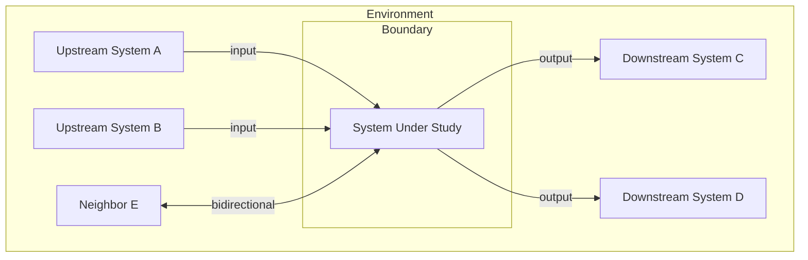

# System Boundary Definition

**Phase:** Foundation — Step 1 **Feeds into:** [stock-and-flow-mapping](stock-and-flow-mapping.md),
[upstream-downstream-synthesis](upstream-downstream-synthesis.md)

## When to Use

- Beginning any systems thinking exercise — boundary definition comes first
- Scoping an improvement effort to avoid boiling the ocean
- Resolving disagreements about what a system is or is not responsible for
- Preparing for stock-and-flow mapping or causal loop analysis
- Identifying integration points with neighboring systems

## Procedure

### 1. State the Purpose

Clarify why the system exists. Answer:

- What is this system supposed to achieve?
- What outcome does it produce for its stakeholders?
- What would happen if this system stopped operating?

### 2. Draw the Boundary

Determine what is inside and what is outside:

| Element                                   | Inside or Outside? | Rationale                         |
| ----------------------------------------- | ------------------ | --------------------------------- |
| _component, process, team, or capability_ | Inside / Outside   | _why this inclusion or exclusion_ |

Rules of thumb:

- If you **control** it and it **directly serves the system's purpose**, it's inside
- If you **depend on** it but don't control it, it's outside (but in the environment)
- If it's **affected by** the system but doesn't contribute to it, it's a downstream dependent

### 3. Map Boundary Crossings

Identify everything that crosses the boundary.

**Inputs (entering the system):**

| Input         | Source (upstream)     | Characteristics              | Assumptions               |
| ------------- | --------------------- | ---------------------------- | ------------------------- |
| _what enters_ | _where it comes from_ | _volume, frequency, quality_ | _what we assume about it_ |

**Outputs (leaving the system):**

| Output       | Destination (downstream) | Characteristics              | Commitments                     |
| ------------ | ------------------------ | ---------------------------- | ------------------------------- |
| _what exits_ | _where it goes_          | _volume, frequency, quality_ | _SLAs, contracts, expectations_ |

### 4. Identify Actors

Map who operates inside the boundary:

| Actor                              | Role           | Influence            | Key Interactions  |
| ---------------------------------- | -------------- | -------------------- | ----------------- |
| _person, team, or automated agent_ | _what they do_ | _decision authority_ | _what they touch_ |

### 5. Map the Neighborhood

Identify adjacent systems that interact with the boundary:

For each neighbor, document:

- What it sends or receives
- How tightly coupled the interaction is
- What breaks if the neighbor changes

### 6. Validate the Boundary

Check for common boundary errors:

- **Too wide** — the system includes things you don't control and can't change
- **Too narrow** — critical components are excluded, making the analysis incomplete
- **Leaky** — important inputs or outputs are missing from the crossing map
- **Static** — the boundary doesn't account for how the system is evolving

### 7. Save the Boundary Definition

Write to `docs/design/system-boundaries/<system-name>.md`.

## Output Format

Each boundary definition document should contain:

1. System purpose statement
2. Boundary inclusion/exclusion table with rationale
3. Input and output crossing tables
4. Actor inventory
5. Neighborhood diagram (Mermaid)
6. Boundary validation notes
7. Open questions and assumptions to revisit

## Rules

- NEVER skip boundary definition — it is the foundation of every systems analysis
- Make inclusion/exclusion decisions explicit with rationale — implicit boundaries cause confusion
- Label assumptions about inputs and outputs — these are testable hypotheses
- Revisit the boundary if analysis reveals it was drawn incorrectly — boundaries are not permanent
