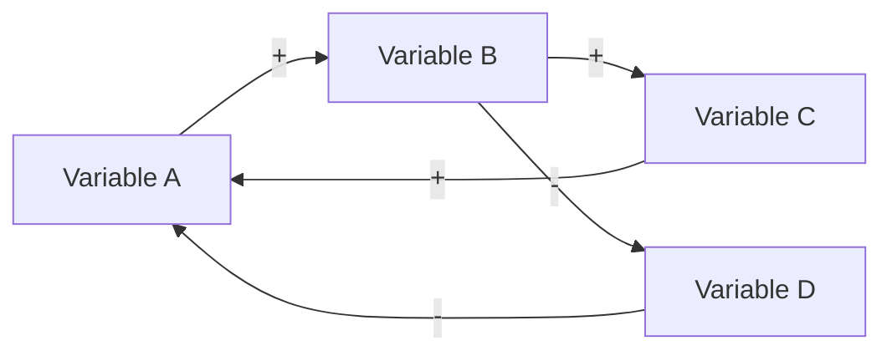

# Causal Loop Mapping

**Phase:** Dynamics — Step 1 **Requires:** [stock-and-flow-mapping](stock-and-flow-mapping.md) **Feeds into:**
[delay-analysis](delay-analysis.md), [leverage-point-analysis](leverage-point-analysis.md),
[archetype-recognition](archetype-recognition.md)

## When to Use

- Investigating why a problem keeps recurring despite fixes
- Understanding why growth accelerates or collapses
- Diagnosing oscillation — things improve then degrade cyclically
- After stock-and-flow mapping, to understand what drives the flows
- When an intervention produced unintended consequences
- Making mental models explicit so the team can reason about them together

## Key Concepts

- **Causal link** — A influences B (same direction `+` or opposite direction `-`)
- **Reinforcing loop (R)** — all links amplify change; creates exponential growth or collapse
- **Balancing loop (B)** — links counteract change; drives toward a goal or equilibrium
- **Delay** — time lag between cause and effect (marked with `delay` on diagrams)
- **Loop dominance** — which loop is currently strongest and driving observed behavior

## Procedure

### 1. Start from Observed Behavior

Identify the behavior pattern the team is trying to explain:

| Pattern                          | Typical Loop Structure                                 |
| -------------------------------- | ------------------------------------------------------ |
| Exponential growth               | Reinforcing loop, unchecked                            |
| Goal-seeking (approaches target) | Balancing loop                                         |
| Oscillation                      | Balancing loop with significant delay                  |
| S-curve (growth then plateau)    | Reinforcing loop hits a balancing loop                 |
| Overshoot and collapse           | Reinforcing loop with delayed balancing feedback       |
| Stagnation                       | Balancing loops dominating, blocking reinforcing loops |

### 2. Trace the Causal Chain

Starting from a key variable, ask repeatedly: "What does this influence? What influences this?"

For each link, determine polarity:

- **Same direction (+)** — when A increases, B increases (and vice versa)
- **Opposite direction (-)** — when A increases, B decreases (and vice versa)

Build a variable table:

| Variable   | Influenced By | Influences | Link Polarity |
| ---------- | ------------- | ---------- | ------------- |
| _variable_ | _cause_       | _effect_   | + or -        |

### 3. Identify Loops

A loop exists when a causal chain returns to its starting variable. Classify each loop:

**Counting rule:** Count the number of negative (`-`) links in the loop.

- **Even number of negatives (including zero)** → Reinforcing (R)
- **Odd number of negatives** → Balancing (B)

| Loop ID | Variables in Loop | Type (R/B)  | Narrative                                     |
| ------- | ----------------- | ----------- | --------------------------------------------- |
| R1      | A → B → C → A     | Reinforcing | _plain-language story of what this loop does_ |
| B1      | A → D → E → A     | Balancing   | _plain-language story_                        |

### 4. Build the Causal Loop Diagram

Use Mermaid to visualize:

Conventions:

- Label each link with `+` or `-`
- Mark delays with `delay` in the link label
- Name each loop (R1, B1, etc.) using a comment or annotation
- Keep diagrams to 3–7 variables per loop for readability; split complex systems into multiple diagrams

### 5. Analyze Loop Dynamics

For each loop, assess:

| Loop | Type        | Dominance              | Delay Present? | Visibility | Current Effect                             |
| ---- | ----------- | ---------------------- | -------------- | ---------- | ------------------------------------------ |
| R1   | Reinforcing | Dominant / Subordinate | Yes / No       | High / Low | _what behavior this loop is producing now_ |
| B1   | Balancing   | Dominant / Subordinate | Yes / No       | High / Low | _what behavior_                            |

Key questions:

- Which loops are currently dominant?
- Are there dormant loops that will activate under certain conditions?
- Where are delays masking cause-and-effect relationships?
- Which loops are visible to decision-makers and which are hidden?

### 6. Identify Loop Interactions

Loops rarely operate in isolation. Map how they interact:

- **Shared variables** — two loops connected through a common variable
- **Dominance shifts** — conditions under which a subordinate loop becomes dominant
- **Competing goals** — two balancing loops pulling toward different targets

### 7. Save the Analysis

Write to `docs/design/system-models/<topic>-causal-loops.md`.

## Output Format

Each causal loop document should contain:

1. Observed behavior pattern being explained
2. Variable inventory with causal links
3. Loop inventory table (ID, type, narrative)
4. Causal loop diagram(s) (Mermaid)
5. Loop dynamics analysis (dominance, delays, visibility)
6. Loop interaction notes
7. Hypotheses — what would change if a specific loop were strengthened or weakened

## Rules

- Every loop must have a plain-language narrative — diagrams without stories are not useful
- Polarity labels (+/-) are required on every link — ambiguous links hide errors
- Mark delays explicitly — they are the most common source of system surprises
- Limit diagram complexity to 3–7 variables per loop; split into sub-diagrams for larger systems
- Causal loops are hypotheses, not proofs — validate with data and observation
