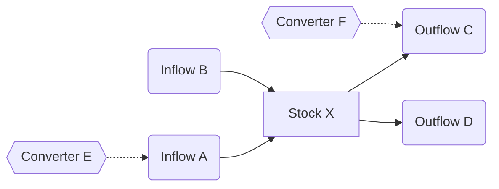

# Stock-and-Flow Mapping

**Phase:** Foundation — Step 2 **Requires:** [boundary-definition](boundary-definition.md) **Feeds into:**
[causal-loop-mapping](causal-loop-mapping.md)

## When to Use

- Understanding why something accumulates (backlog, debt, inventory, knowledge)
- Diagnosing capacity problems or resource depletion
- After boundary definition, to understand the system's physical or informational structure
- Before feedback loop analysis — stocks and flows are the foundation of causal loops
- When the team is confused about what is changing vs. what is accumulating

## Key Concepts

- **Stock** — an accumulation that can be measured at a point in time (queue depth, headcount, trust level, technical
  debt)
- **Inflow** — a rate that adds to the stock over time
- **Outflow** — a rate that drains the stock over time
- **Converter** — a factor that influences a flow rate without being a stock itself (e.g., policy, skill level,
  automation)

The fundamental equation: `Stock(t) = Stock(t-1) + Inflows - Outflows`

## Procedure

### 1. Identify the Core Question

What behavior is the team trying to understand? Examples:

- Why does the backlog keep growing?
- Why is team capacity declining?
- Where is knowledge being lost?
- Why do quality problems persist despite investment?

The answer to "what is accumulating or depleting?" points to the central stock.

### 2. Inventory Stocks

Starting from the core question, identify all relevant accumulations:

| Stock              | Description          | Unit                | Current Trend                           |
| ------------------ | -------------------- | ------------------- | --------------------------------------- |
| _what accumulates_ | _what it represents_ | _how it's measured_ | Rising / Falling / Stable / Oscillating |

Common stock categories:

- **Work items** — requests, tickets, orders, cases in various stages
- **Resources** — people, budget, compute capacity, inventory
- **Knowledge** — documentation, expertise, institutional memory
- **Quality** — defect counts, technical debt, trust, reputation
- **Relationships** — customer satisfaction, team morale, stakeholder confidence

### 3. Trace Flows for Each Stock

For each stock, identify what increases and decreases it:

| Stock   | Inflows (what adds) | Outflows (what drains) | Converters (what influences rates) |
| ------- | ------------------- | ---------------------- | ---------------------------------- |
| _stock_ | _rate 1, rate 2_    | _rate 3, rate 4_       | _factor A, factor B_               |

Probe for completeness:

- Are there inflows you're not measuring?
- Are there outflows being ignored (e.g., attrition, decay, obsolescence)?
- What determines the rate of each flow?

### 4. Build the Stock-and-Flow Diagram

Use Mermaid to visualize:

Conventions:

- **Rectangles** `[]` for stocks
- **Rounded** `()` for flows
- **Hexagons** `{{}}` for converters
- **Solid arrows** `-->` for material/information flow
- **Dashed arrows** `-.->` for influence on flow rates

### 5. Identify Stock Interactions

Stocks often feed into each other. Map the chains:

- Does the outflow of one stock become the inflow of another?
- Do stock levels influence flow rates of other stocks?

These interactions are where feedback loops emerge — flag them for [causal-loop-mapping](causal-loop-mapping.md).

### 6. Assess Stock Health

For each stock, evaluate:

| Stock   | Desired State           | Current State  | Gap     | Trend Direction                  | Time to Critical                              |
| ------- | ----------------------- | -------------- | ------- | -------------------------------- | --------------------------------------------- |
| _stock_ | _target level or range_ | _actual level_ | _delta_ | _improving / worsening / stable_ | _if worsening, when does it become a problem_ |

### 7. Save the Map

Write to `docs/design/system-models/<topic>-stocks-flows.md`.

## Output Format

Each stock-and-flow map should contain:

1. Core question being investigated
2. Stock inventory table
3. Flow details for each stock (inflows, outflows, converters)
4. Stock-and-flow diagram (Mermaid)
5. Stock interaction notes (where feedback loops may exist)
6. Stock health assessment
7. Open questions — unmeasured flows, unknown converters

## Rules

- Every stock must have at least one inflow and one outflow — if you can't find both, the boundary may be wrong
- Flows are rates (per unit time), stocks are levels (at a point in time) — don't confuse the two
- Label units explicitly — "claims" vs. "hours" vs. "trust" prevents category errors
- If a stock is rising and nobody knows why, look for hidden inflows
- If a stock is falling and nobody is draining it, look for unmeasured outflows (decay, attrition, obsolescence)
