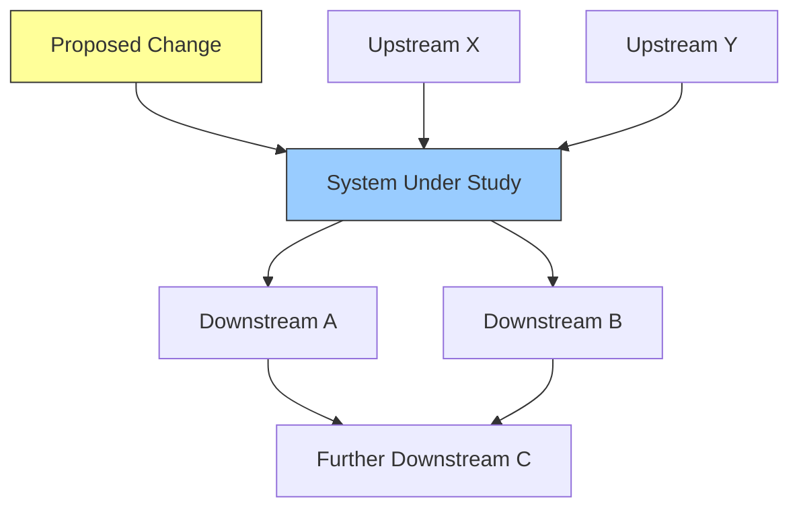

# Upstream and Downstream Synthesis

**Phase:** Cross-Boundary Analysis **Requires:** [boundary-definition](boundary-definition.md) **Feeds into:**
[intervention-design](intervention-design.md)

## When to Use

- Evaluating the blast radius of a proposed change
- Understanding what feeds into a system and what depends on its outputs
- Identifying hidden coupling between systems that appear independent
- Synthesizing knowledge across platform, team, or organizational boundaries
- After boundary definition — this zooms out to the neighborhood and beyond
- When a change in one system produced unexpected effects in another

## Procedure

### 1. Anchor the Analysis

Identify the system or change being analyzed:

- What system is at the center of this analysis?
- What change (proposed or actual) are we tracing?
- What boundary definition exists? (Reference output from [boundary-definition](boundary-definition.md))

### 2. Map Upstream Dependencies

Trace what feeds into the system from upstream:

| Input         | Immediate Source  | Origin (root source) | Hops                          | Volume / Frequency           | Quality Assumptions               |
| ------------- | ----------------- | -------------------- | ----------------------------- | ---------------------------- | --------------------------------- |
| _what enters_ | _direct provider_ | _ultimate origin_    | _how many systems in between_ | _throughput characteristics_ | _what we assume about this input_ |

For each upstream source, probe:

- What determines the volume, quality, and timing of this input?
- What would happen if this input degraded, stopped, or changed format?
- What upstream changes are planned that could affect us?
- How many intermediaries exist between the origin and our system?

### 3. Map Downstream Dependencies

Trace what depends on the system's outputs:

| Output       | Immediate Consumer | End Consumer    | Hops                          | Commitments                     | Sensitivity               |
| ------------ | ------------------ | --------------- | ----------------------------- | ------------------------------- | ------------------------- |
| _what exits_ | _direct consumer_  | _ultimate user_ | _how many systems in between_ | _SLAs, contracts, expectations_ | _how tolerant of changes_ |

For each downstream consumer, probe:

- What do they do with this output?
- What breaks if the output changes format, timing, or quality?
- What commitments constrain how the output can change?
- Do they have alternatives if this system stops producing?

### 4. Identify Lateral Dependencies

Not all connections are linear. Map bidirectional and shared-resource dependencies:

| System A | System B | Shared Resource / Channel | Interaction Type                               | Coupling Strength |
| -------- | -------- | ------------------------- | ---------------------------------------------- | ----------------- |
| _system_ | _system_ | _what they share_         | Bidirectional / Shared resource / Event-driven | Tight / Loose     |

### 5. Trace Ripple Effects

For the change being analyzed, trace how effects propagate:

For each hop in the chain:

| Hop | From               | To                   | Effect         | Delay      | Magnitude    | Confidence          |
| --- | ------------------ | -------------------- | -------------- | ---------- | ------------ | ------------------- |
| 1   | System Under Study | Downstream A         | _what changes_ | _time lag_ | High/Med/Low | High/Med/Low        |
| 2   | Downstream A       | Further Downstream C | _what changes_ | _time lag_ | _magnitude_  | _lower at each hop_ |

Note: Confidence typically decreases with each hop — effects at 3+ hops are hypotheses, not predictions.

### 6. Cross-Boundary Knowledge Synthesis

Identify where knowledge is lost, duplicated, or contradicted across boundaries:

| Boundary                | Knowledge on Side A    | Knowledge on Side B    | Gap / Conflict                             |
| ----------------------- | ---------------------- | ---------------------- | ------------------------------------------ |
| _between which systems_ | _what this side knows_ | _what that side knows_ | _what's lost, duplicated, or contradicted_ |

Common patterns:

- **Translation loss** — meaning changes as information crosses boundaries
- **Invisible dependencies** — side A doesn't know side B depends on it
- **Duplicated effort** — both sides solve the same problem independently
- **Constraint ignorance** — one side makes decisions without knowing the other's constraints

### 7. Save the Analysis

Write to `docs/design/system-models/<topic>-dependencies.md`.

## Output Format

Each upstream/downstream analysis should contain:

1. Anchor — system and change being analyzed
2. Upstream dependency map (table + diagram)
3. Downstream dependency map (table + diagram)
4. Lateral dependency inventory
5. Ripple effect trace with confidence levels
6. Cross-boundary knowledge gaps
7. Risk summary — what could break and how far effects could propagate

## Rules

- Confidence decreases with each hop — label it explicitly
- Hidden coupling is more dangerous than visible coupling — probe for what people don't know they depend on
- Map in both directions — upstream analysis reveals fragility, downstream analysis reveals blast radius
- Treat cross-boundary knowledge gaps as risks — they are where surprises originate
- This analysis is a snapshot — revisit when the system neighborhood changes
