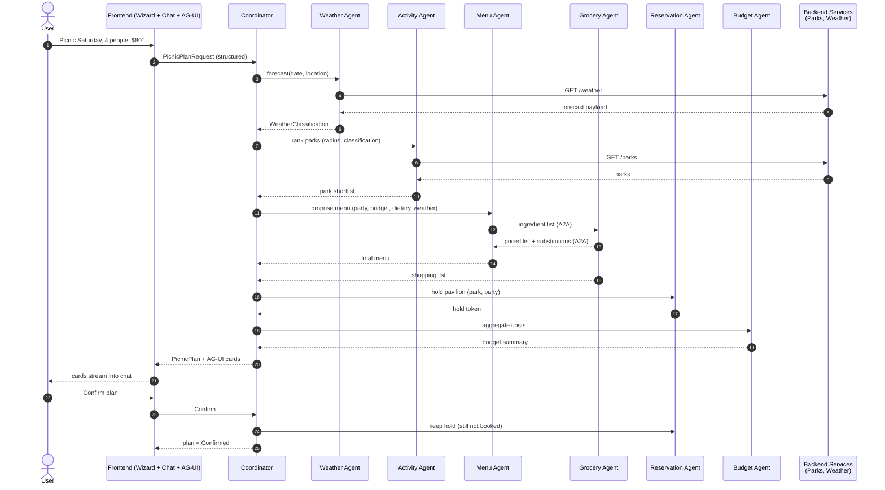
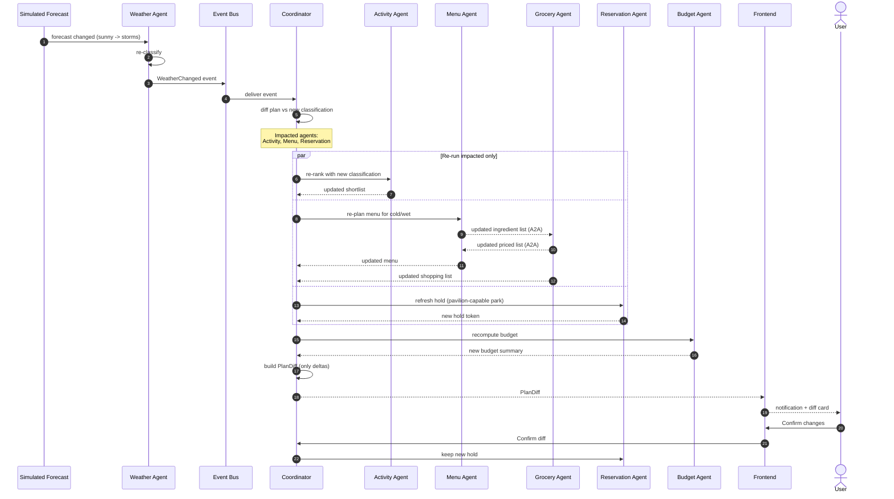

# Service Blueprint — Picnic In The Park

Swim lanes for the headline scenario, including the re-plan loop. This blueprint should be
read alongside [journey-map.md](journey-map.md) — the journey is what the user experiences;
the blueprint is what the system does to make that experience happen.

## Lanes

1. **User** — what the human says, does, and sees.
2. **Frontend** — React/Vite chat UI, wizard component, AG-UI host, diff renderer.
3. **Coordinator** — hosted Agent Framework agent; orchestrates and re-plans.
4. **Specialist agents** — Weather, Activity, Menu, Grocery, Reservation, Budget.
5. **Backend & services** — Planner API, Parks Service, Weather Service.
6. **Event bus** — Azure-native (pending [PRD OQ-1](prd.md#11-open-questions--assumptions)).
7. **External / simulated** — forecast feed, reservation mock, grocery mock.

## Plan-creation flow

## Re-plan flow (the headline)

## Front-stage vs. back-stage

| Front-stage (visible to user)  | Back-stage (hidden)                                  |
| ------------------------------ | ---------------------------------------------------- |
| Chat messages, wizard prompts. | Coordinator intent parsing.                          |
| AG-UI cards per agent.         | Specialist agent invocations and tool calls.         |
| Diff notification on re-plan.  | Event-bus delivery, plan-diff computation.           |
| Confirmation buttons.          | Reservation hold lifecycle (held → kept → released). |
| Budget total.                  | Cost-event aggregation across agents.                |

## Failure & degradation modes (non-exhaustive)

| Failure                                  | Behaviour                                                                                                                           |
| ---------------------------------------- | ----------------------------------------------------------------------------------------------------------------------------------- |
| Weather Service unavailable.             | Weather Agent returns `Unknown` classification; Activity ranks conservatively; UI labels degraded confidence.                       |
| Parks Service slow.                      | Activity Agent times out gracefully; Coordinator surfaces partial plan with retry option.                                           |
| Grocery mock returns missing items.      | Grocery → Menu A2A initiates substitution loop; bounded to N rounds (anti-archetype, see [system-dynamics.md](system-dynamics.md)). |
| Reservation hold expires before confirm. | Reservation emits event; Coordinator surfaces "hold expired — re-acquire?" diff.                                                    |
| Event-bus delivery delayed.              | Re-plan is late but eventually consistent; UI shows "checking for updates".                                                         |

## Observability touchpoints

- Every arrow in the diagrams above corresponds to a trace span (Aspire + Foundry).
- `PlanDiff` artefacts are persisted per re-plan for replay and demo capture.
- Cost events flow through the Budget Agent and are independently inspectable.

## Mapping to the PRD

- Plan-creation flow → functional requirements FR-C1..C3, FR-W1..W2, FR-A1..A3, FR-M1..M2,
  FR-G1, FR-R1..R2, FR-B1..B3, FR-U1..U3.
- Re-plan flow → FR-C3..C5, FR-W3, FR-A4, FR-M3, FR-G2, FR-U4.
- Failure modes → NFR-6 (resilience), NFR-3 (observability).
