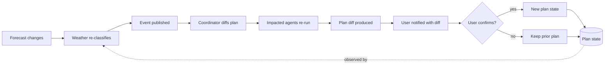
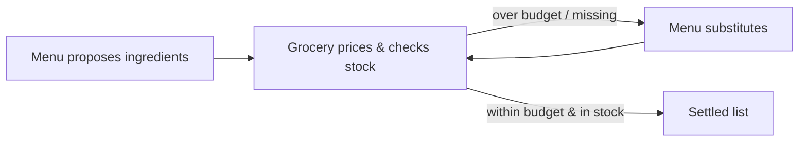
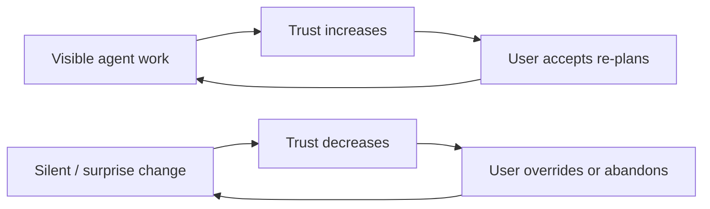

# System Dynamics — Picnic In The Park

A systems-thinking pass over the architecture in [notes.md](notes.md) and the requirements
in [prd.md](prd.md). The goal is to surface loops, delays, and archetypes that should be
_designed for deliberately_ rather than discovered in production (or worse, on stage during
the demo).

## 1. System boundaries

**Inside the system**

- Coordinator agent
- Specialist agents: Weather, Activity, Menu, Grocery, Reservation, Budget
- Event bus (Azure-native, see [PRD OQ-1](prd.md#11-open-questions--assumptions))
- Plan state store
- Frontend (chat, wizard, AG-UI host, diff renderer)
- Backend services: Planner API, Parks Service, Weather Service

**Outside but connected**

- The human user (provides intent, confirmations, sometimes overrides)
- Simulated external feeds: forecast updates, reservation availability, grocery catalogue
- Foundry runtime (hosts the agents)
- Aspire dashboard & Foundry traces (observation only — no control)

**Explicitly out of scope**

- Real reservation / payment / grocery integrations
- Identity, accounts, persistence beyond the active plan
- Mobile clients, offline mode

## 2. Stocks and flows

| Stock                                               | Inflow                                             | Outflow                                                   |
| --------------------------------------------------- | -------------------------------------------------- | --------------------------------------------------------- |
| **Current plan state** (the `PicnicPlan` aggregate) | Agent outputs; user confirmations.                 | Re-plan diffs that mutate the plan; plan completion.      |
| **Pending agent tasks**                             | Coordinator dispatches.                            | Agent completions; timeouts.                              |
| **Held reservations**                               | Reservation Agent hold acquisitions.               | Confirmations (become bookings — simulated); expirations. |
| **Projected cost**                                  | Cost events from Menu, Grocery, Reservation.       | User reductions; plan trimming on re-plan.                |
| **User trust / confidence**                         | Visible agent work; diff legibility; honest gates. | Silent automation; surprise changes; latency.             |

User trust is a stock too — and arguably the most fragile. It is replenished by visibility
and depleted by surprise.

## 3. Causal loops

### 3.1 The re-planning loop (reinforcing, with guardrails)

This loop is _desired_ but must be **bounded**: see archetypes §5.

### 3.2 A2A negotiation loop — Menu ↔ Grocery (balancing)

Balancing toward a feasible list. Risk: unbounded ping-pong if substitution criteria are
loose. Mitigation: cap rounds (e.g., 3), then escalate to user.

### 3.3 User-confidence loop (can be reinforcing in _either_ direction)

The same architecture can sit at either fixed point depending on UI choices. AG-UI cards
and diff-only re-plans are the levers that keep us on the upper loop.

## 4. Delays and leverage points

| Delay                                  | Magnitude (rough)                                   | Why it matters                                                 |
| -------------------------------------- | --------------------------------------------------- | -------------------------------------------------------------- |
| External API latency (weather, parks). | 100ms–2s                                            | Adds latency to every agent invocation; compounds in re-plans. |
| Forecast refresh cadence.              | Minutes to hours (simulated as on-demand for demo). | Controls how often the re-plan loop can even fire.             |
| Human confirmation gate.               | Seconds to days (out of session).                   | The biggest delay; must be designed as a feature, not a bug.   |
| Event-bus delivery.                    | < 1s on Azure-native.                               | Determines how "live" the re-plan feels.                       |
| LLM call duration in agents.           | 1–10s.                                              | Dominates UX latency; per-agent streaming matters.             |

**Highest-leverage intervention points** (where small design choices have outsized effect):

1. **The Coordinator's diff logic.** Whether re-plan surfaces "only what changed" or "the
   whole new plan" determines whether the demo lands at all. This is the single highest
   leverage point in the system.
2. **The HITL wizard / confirmation gates.** They convert irreversible actions into
   reversible decisions and replenish the trust stock.
3. **A2A round caps.** Trivial to add, prevent runaway negotiations.
4. **AG-UI per-agent cards.** Convert hidden work into visible work, which is what keeps
   the user-confidence loop on the upper fixed point.
5. **Event debouncing.** A small debounce on weather events prevents thrash when forecasts
   oscillate.

## 5. Archetypes to design against

### Fixes That Fail — aggressive re-planning

If the Coordinator re-plans on every minor weather wobble, the user sees constant churn,
loses trust, and disengages. The "fix" (more responsiveness) creates the problem (anxiety
and abandonment).

**Design response:** debounce weather events; require a classification change (not a value
change) to trigger; cap re-plans per session.

### Shifting the Burden — over-reliance on the agent

If the user defers all judgement to the agent, they stop validating outputs (does that
park actually have a pavilion? Is hot soup really right for 17°C?). When the agent is
wrong, the user has no recourse.

**Design response:** show _why_ — surface the weather classification, the ranking signal,
the budget impact. Make the user a reviewer, not a passenger.

### Limits to Growth — agent-count complexity

Each new specialist agent adds N edges of potential coordination, not 1. Beyond a small
number, Coordinator complexity grows faster than the value of additional specialists.

**Design response:** hold the line at the agent set in the PRD (6 specialists + Coordinator).
Resist adding agents during demos; favour deepening existing ones.

### Eroding Goals — silent quality drift

If the Coordinator silently relaxes constraints (over budget, longer drive) to keep the
plan feasible, the user's goals erode without their knowledge.

**Design response:** every constraint relaxation must be a visible diff item.

## 6. Interventions (design commitments)

| #     | Intervention                                                                                | Maps to                    |
| ----- | ------------------------------------------------------------------------------------------- | -------------------------- |
| INT-1 | Re-plan triggers on **classification change**, not raw value change.                        | FR-W3                      |
| INT-2 | Coordinator always produces a `PlanDiff`; UI never re-renders the whole plan on re-plan.    | FR-C5, FR-U4               |
| INT-3 | A2A loops are bounded (e.g., 3 rounds) before escalating to user.                           | FR-M3, FR-G2               |
| INT-4 | Irreversible actions (booking, purchasing) are always gated behind explicit confirmation.   | FR-C6, FR-R2               |
| INT-5 | Each agent renders an AG-UI card with its reasoning summary, not just its result.           | FR-U3                      |
| INT-6 | Constraint relaxations (over budget, expanded radius) appear in the diff as explicit items. | Eroding-Goals archetype    |
| INT-7 | Weather events are debounced (e.g., 60s) on the Weather Agent side.                         | Fixes-That-Fail archetype  |
| INT-8 | The agent set is frozen at the PRD list; new agents require an ADR.                         | Limits-to-Growth archetype |

## 7. Top three leverage points to design around

1. **The diff surface.** Build it first; everything else hangs off the assumption that
   re-plan = diff.
2. **Confirmation gates.** They are the contract with the user; they're cheap to add and
   expensive to retrofit.
3. **Visibility (AG-UI cards + Aspire/Foundry traces).** Visibility is what keeps trust on
   the upper loop and turns this demo into a teaching tool.

## 8. Where this contradicts or extends notes.md

- [notes.md](notes.md) lists event-driven re-planning as the "killer demo" but doesn't
  bound it — this doc adds INT-1 and INT-7 (classification gating and debouncing) so the
  demo doesn't thrash.
- notes.md hints at Budget as an aggregating agent — this doc flags it as a guardrail
  against the Eroding-Goals archetype, which raises [PRD OQ-4](prd.md#11-open-questions--assumptions)
  (agent vs. service).
- notes.md does not cap A2A rounds — INT-3 adds that.
- notes.md frames AG-UI as visual flair — this doc reframes it as a _trust-replenishment_
  mechanism, i.e., it serves both pedagogy and user-experience.
